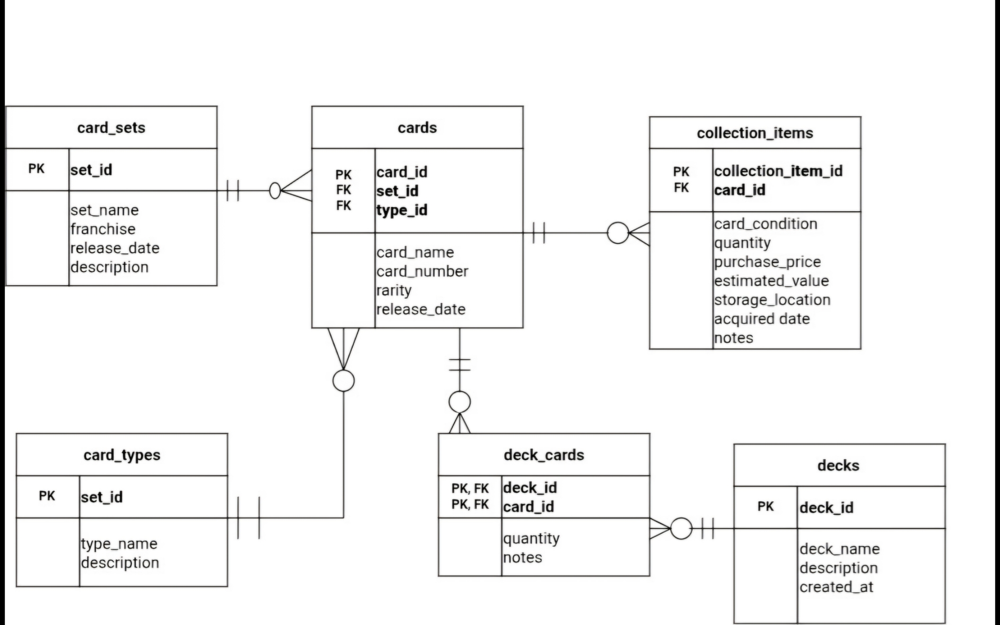

# Trading Card Collection Database

## Description

For this project I chose to make a database for my husband's trading card collection. The collection contains Pokémon, Marvel, and FIFA cards. The purpose is to keep the card information organized in one database.

## ER model

## Design decisions

The database has six tables: `card_sets`, `card_types`, `cards`, `collection_items`, `decks`, and `deck_cards`.

I separated `cards` from `collection_items` because `cards` stores general information about a published card, while `collection_items` stores information about the copies that are owned. This makes it possible to own the same card in different conditions or with different purchase prices.

One set can contain many cards, one card type can be used by many cards, and one card can have several collection items.

Cards and decks have a many-to-many relationship because a deck can contain many cards and the same card can appear in several decks. The `deck_cards` table resolves this relationship and uses `deck_id` and `card_id` as its primary key.
